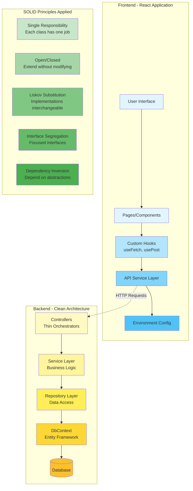

# Architecture Diagram

## Layer Responsibilities

### Frontend Layers
1. **User Interface**: React components, routing, presentation
2. **Custom Hooks**: Reusable logic for data fetching and state management
3. **API Service**: Centralized API communication with interceptors
4. **Environment Config**: Configuration management for different environments

### Backend Layers
1. **Controllers**: Handle HTTP requests, validation, and response formatting
2. **Service Layer**: Business logic, domain rules, orchestration
3. **Repository Layer**: Data access abstraction, CRUD operations
4. **DbContext**: Entity Framework Core, database connection
5. **Database**: Data persistence

## Communication Flow

**Request Flow:**
```
User Action → Component → Custom Hook → API Service → HTTP Request 
    → Controller → Service → Repository → DbContext → Database
```

**Response Flow:**
```
Database → DbContext → Repository → Service → DTO → Controller 
    → JSON Response → API Service → Custom Hook → Component → UI Update
```

## Key Benefits

✅ **Separation of Concerns**: Each layer has a distinct responsibility  
✅ **Loose Coupling**: Layers communicate through interfaces  
✅ **High Testability**: Each layer can be tested independently  
✅ **Easy Maintenance**: Changes isolated to specific layers  
✅ **Scalability**: Easy to add new features following established patterns  
